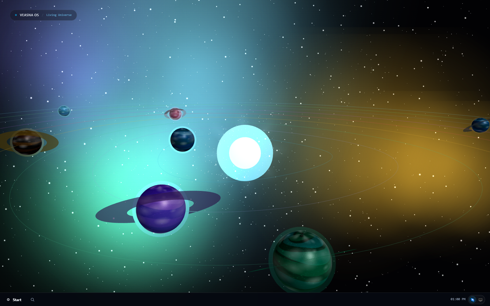
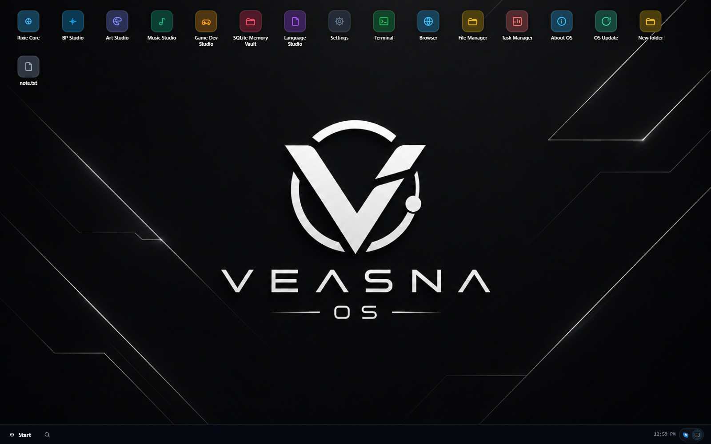
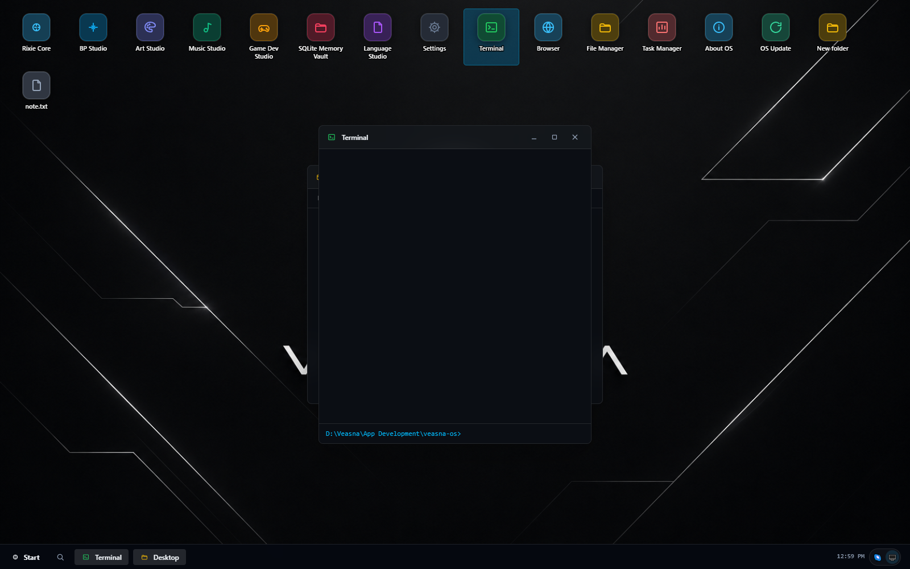

# 🌌 Veasna OS

> Welcome home.

Veasna OS is not a productivity app.

It is a universe where creators build ideas, music, games, apps, stories and dreams.

Every project is a world.

Every idea is a star.

Every creation begins with curiosity.

<p align="center">
  
  
</p>

---

## The Shell

The front door to Veasna OS is **Universe** — a desktop-style shell with two faces:

- 🌌 **3D mode** — each studio is a celestial body orbiting in a living cosmos, click one to open it.
- 🖥️ **List mode** (default) — a familiar Windows-style desktop: draggable/resizable windows, a taskbar with pinning and auto-hide, a Start menu, folders and files you can create right on the desktop, a real terminal, a real file manager, and a real browser.

Both modes share the same window system, so switching between them never loses what you have open.

**Rixie** is the sun at the center of the cosmos — and she's genuinely core to the OS, not a studio you have to go open. A persistent-memory AI agent chat, one click away from her own taskbar icon in any mode, with real awareness of what you actually have open right now (active window, terminal location, the folder you're browsing).

<p align="center">
  
</p>

---

## Studios

| Studio | What it is | Status |
| --- | --- | --- |
| 🌌 Universe | The OS shell itself — 3D cosmos + desktop | Active |
| 🎬 BP Studio | Beyond Perspective — idea → script → create → publish | Active |
| 🎮 Game Dev | Loom Engine — a browser-based 2D game engine/editor with its own scripting DSL | Active |
| 🎵 Music | — | Coming soon |
| 🎨 Art | — | Coming soon |
| 🌍 Language | — | Coming soon |

---

## Desktop App

Veasna OS also ships as a real, installable Windows desktop app (Electron) — no browser tab, no separate dev servers to remember. Universe, BP Studio, and Game Dev Studio are all bundled together, each running on its own local port under the hood; it feels like one app.

```bash
pnpm dev:desktop     # run it against your local dev servers, with hot reload
pnpm build:desktop   # produce a real installer at apps/desktop/release/
```

Rixie's API key can be entered right from **Settings → Rixie AI** — no `.env` file editing required once it's installed, and it takes effect on her very next reply with no restart needed.

---

## Monorepo Layout

A pnpm workspace: each studio is its own app, shared code lives in packages.

```
studios/
  universe/    the OS shell (Next.js) — default entry point
  bp/          Beyond Perspective
  gamedev/     Loom Engine (Vite)

packages/
  universe/    shell UI: desktop, windows, taskbar, settings, cosmos
  ai/          shared AI utilities
  ui/, auth/, database/, storage/, editor/, analytics/, automation/, utils/, vicons/

apps/
  desktop/     the Electron wrapper — packages the studios above into a real installable app
```

### Running a studio

Requires [Node.js](https://nodejs.org) 20.9+ (an LTS release, e.g. 22.x) and [pnpm](https://pnpm.io) (`corepack enable` installs the right version automatically from this repo's `packageManager` field).

```bash
git clone --recurse-submodules https://github.com/veasnawt/veasna-os.git
cd veasna-os

pnpm setup    # installs everything + creates studios/universe/.env.local from its template
pnpm dev:all  # everything at once — Universe, BP Studio, and Loom Engine together
```

Already cloned without `--recurse-submodules`? Run `git submodule update --init` to fetch `packages/loom`.

Then open `studios/universe/.env.local` and fill in your own model provider API key (see `studios/universe/.env.example`) — everything works without one except Rixie's chat (or set it later, in-app, via **Settings → Rixie AI** in the desktop app). `pnpm setup` never overwrites an existing `.env.local`, so it's safe to re-run any time.

<details>
<summary><strong>Windows install troubleshooting</strong> (click to expand)</summary>

**`pnpm setup` fails on `better-sqlite3` with `gyp ERR! find VS` / "Could not find any Visual Studio installation"** — `better-sqlite3` ships prebuilt binaries for common Node versions, so this only happens on a Node version newer than what's been prebuilt yet. Two fixes, pick one:
- **Switch to Node LTS (recommended)** — e.g. with [nvm-windows](https://github.com/coreybutler/nvm-windows): `nvm install 22 && nvm use 22`, delete `node_modules`, re-run `pnpm setup`.
- **Or install the real build toolchain** — [Visual Studio Build Tools](https://visualstudio.microsoft.com/downloads/#build-tools-for-visual-studio-2022), "Desktop development with C++" workload.

**The failure instead mentions symlinks, `EPERM`, or "operation not permitted"** — pnpm's `node_modules` relies on symlinks, which Windows only allows for Administrators or accounts with Developer Mode enabled. Fix: **Settings → Privacy & security → For developers → Developer Mode → On**, then re-run `pnpm setup`. (This also unlocks `pnpm build:desktop`'s installer step, which needs the same permission.)

</details>

Or run just what you need:

```bash
pnpm dev          # Universe — http://localhost:3000
pnpm dev:bp       # BP Studio — http://localhost:3001
pnpm dev:gamedev  # Loom Engine — http://localhost:5173
```

Studio windows inside Universe embed the other studios directly (`bp`, `gamedev`) — running them isn't required just to browse Universe itself, but it is required for those specific windows to load anything. `pnpm dev:all` is the easiest way to get everything working at once.

---

## Security

Two of Universe's API routes give it real power over the machine it runs on, and both are guarded accordingly:

- **Terminal** (`/api/terminal`) executes real shell commands with your OS user's own privileges.
- **Files** (`/api/files`) reads/writes the real filesystem — sandboxed to a single `.desktop/` folder at the repo root, so it can't escape that folder, but it's still real disk I/O.

Both routes reject any request that doesn't look like it came directly from `localhost` (see `studios/universe/app/api/_lib/localOnlyGuard.ts`) — but **this is a best-effort guard against accidental exposure, not a hard security boundary.** The real protection is simpler: **never bind Universe's dev/prod server to a public interface** (no `next start -H 0.0.0.0`, no port-forwarding, no reverse proxy, no tunnel like ngrok/Cloudflare Tunnel pointed at it). This project is built for one person running it on their own machine — it was never designed or audited for multi-user or public-internet exposure, and shouldn't be deployed that way.

Secrets (`.env*.local` files, `*.db` files, the `.desktop/` sandbox) are gitignored at the repo root — `git status` should never show them as trackable. If you fork or extend this project, keep that pattern: real credentials go in `.env.local` (never committed), a matching `.env.example` with placeholder values goes in the repo so others know what to set up.

---

## Philosophy

Build tools that make future me smile.

---

## Status

🌌 Age I

The Big Bang

---

## License

[GNU AGPL v3.0](./LICENSE). The short version: you're free to use, modify, and redistribute this — but if you run a modified version as a network service that other people can access, you have to make your modified source available to them too. This is a copyleft license specifically chosen to prevent someone taking this project closed-source as a hosted product.
